# Support:  (Un)locked doors 🗝️ (FLAG 1)

On doit identifier les faiblesses dans un portail de support écrit en python.
Le code source est fourni, une instance est accessible, la première cible est dans la page `/user.html` quand on est connecté avec le compte `support` dont nous n'avons pas les cédentials.

Rien de très intéressant en parcourant le site sans être authentifié, allons plutôt voir le code source.  
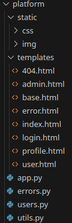

Une ACL "rbac" custom, en temps que guest on est supposé avoir accès uniquement à `/index.html`, `/404.html` et `/login.html`  
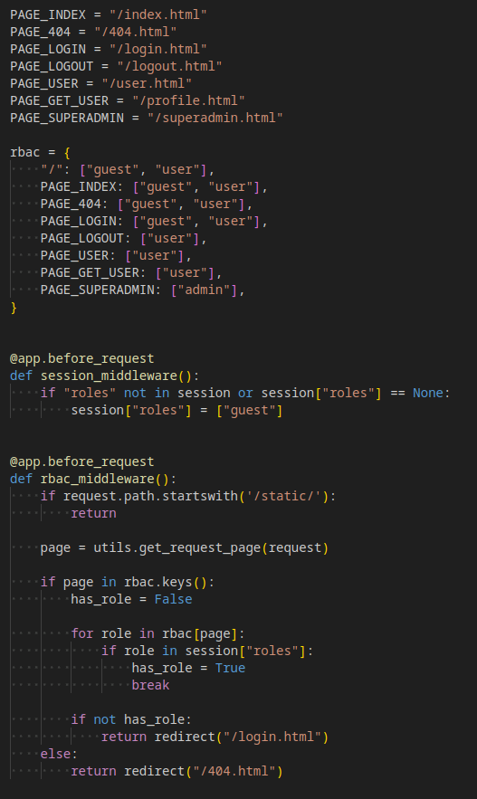  
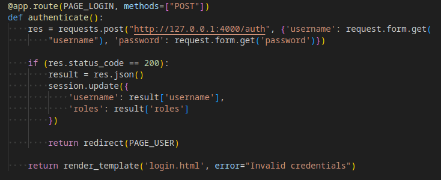  
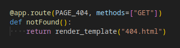  
  
Rien qui ne saute aux yeux ici 🤔

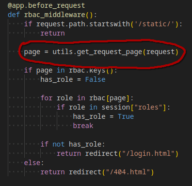  
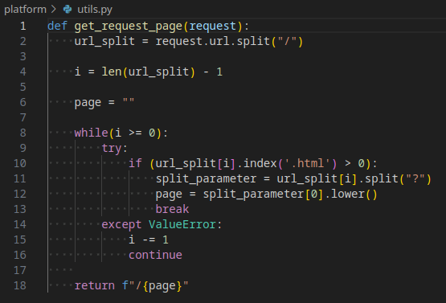  
Oh, un parsing custom determine quelle page on consulte pour valider les permissions. What could go wrong ?  
L'URL est `split` sur les `/`, on parcoure le tableau en commençant par la fin à la recherche d'un `.html` et l'on prend le premier morceau avant un `?`  

On doit pouvoir utiliser ça pour contourner l'ACL, mais pour consulter quelle page ?  
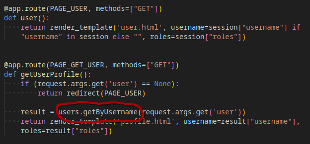  
`getByUsername` ?  
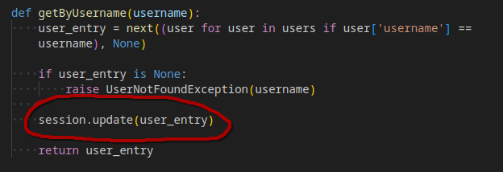  
Je dirais plutôt `impersonateByUsername` 😁 On va pouvoir utiliser la page `/profile.html`  

Nous sommes maintenant connecté en temps que `support`

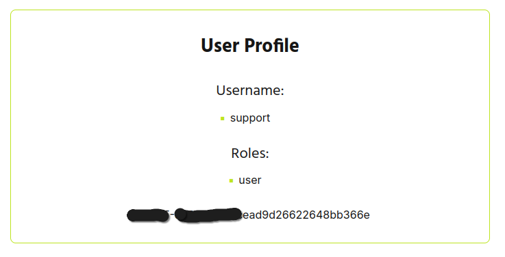

# Support: Not so secret 🤫 (FLAG 2)

La seconde cible est encore dans la page `/user.html`, mais du compte administrateur. Problème : le nom du compte nous est inconnu ...

On cherche un nom d'utilisateur, c'est le genre de chose qui n'est habituellement pas très protégé. Peut-être qu'il est divulgué quelque part.  
Dans des métadonnées de fichier, peu être ?  
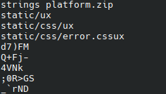  
Les images gardent parfois des traces de leur créateur ?  
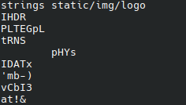  
Rien ...

Lisons une nouvelle fois la description du défi au cas où l'on ait manqué quelque chose.  
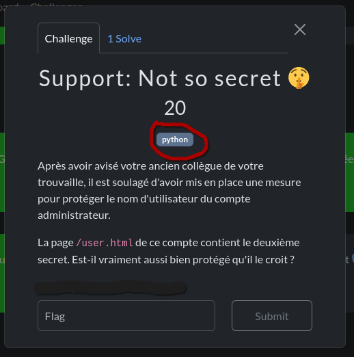  
🤦  
Fausse route complète, le défi est identifié comme un défi `python` ; retour aux sources !  

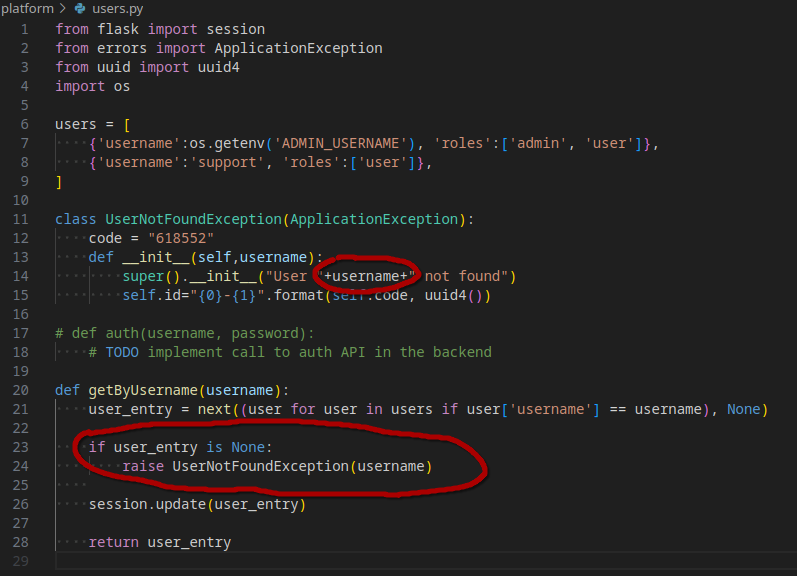  
Hum, on peut contrôler `username`, une entrée de l'erreur affichée si l'on affiche la page `/profile.html` pour un utilisateur inexistant.

Ça sent l'injection de template Jinja  
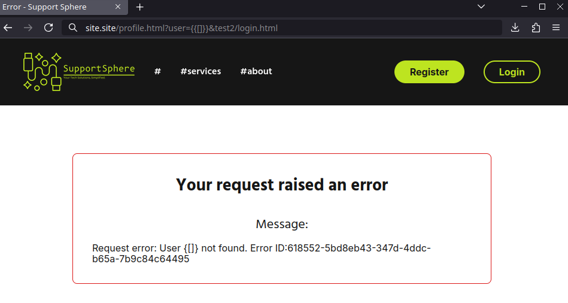  
Étrange  
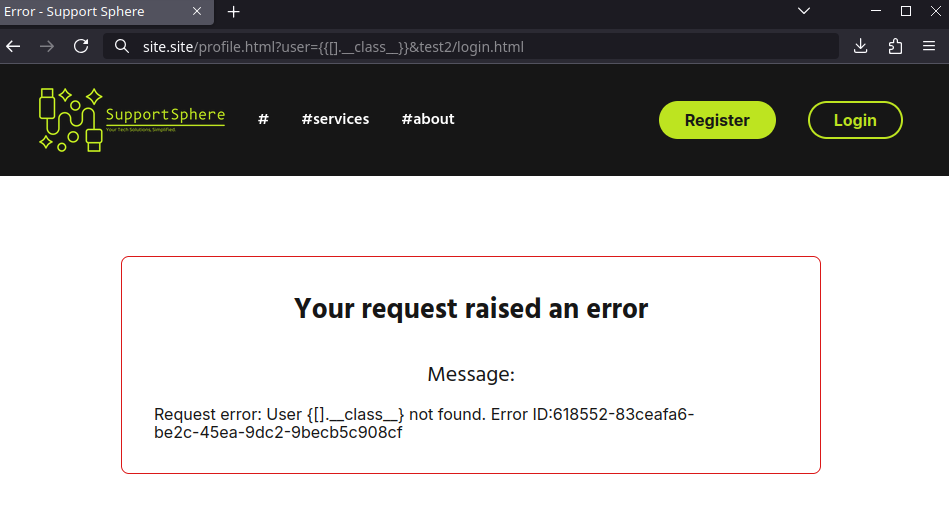  
Très étrange  
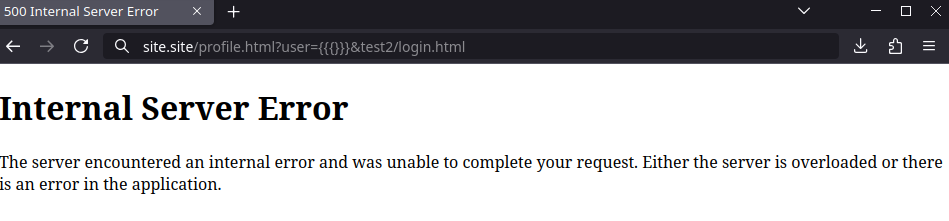  
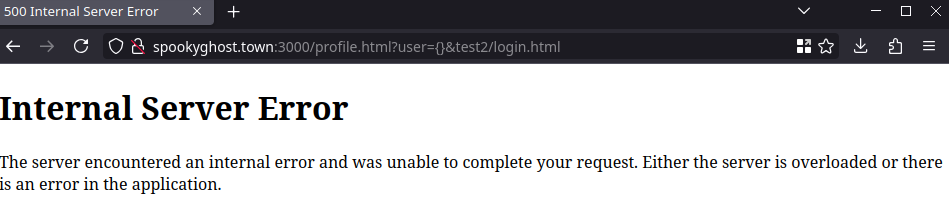  
Les traditionnelles injections Jinja ne fonctionnent pas, et il semble y avoir un escaping de la moitié des `{}` 🧐

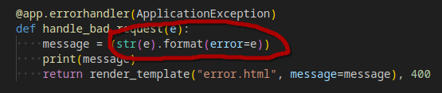  
💡 Ça n'est pas une injection Jinja. C'est une injection dans `string.format`  
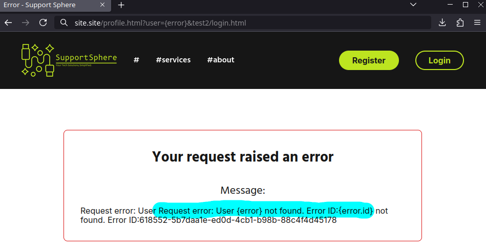  

On a seulement accès à l'objet `error`, mais c'est suffisant. Let's go `__mro__`  
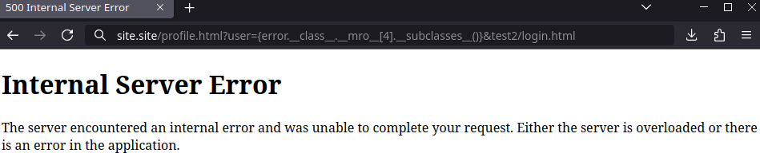  
Que se passe-t-il ? 😿  
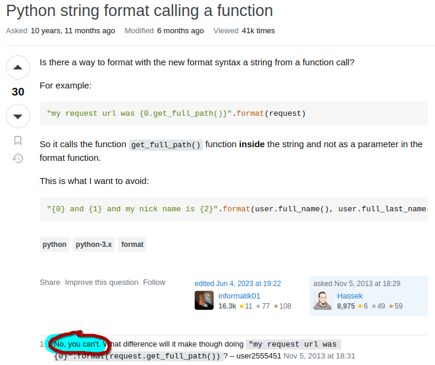  
Il n'est pas possible d'appeler des fonctions dans `format`.

Mais `UserNotFoundException` hérite de `ApplicationException` et donc de `Exception` et les exceptions ont un stacktrace 😻

Voyons :  
`{error.__traceback__.tb_frame.f_code.co_filename}` -> `/usr/lib/python3/dist-packages/flask/app.py`  
`{error.__traceback__.tb_frame.f_back.f_code.co_filename}` -> `/usr/lib/python3/dist-packages/flask/app.py`  
`{error.__traceback__.tb_frame.f_back.f_back.f_code.co_filename}` -> `/usr/lib/python3/dist-packages/werkzeug/serving.py`  
Hum, on semble être dans le framework, ça fait du sens on ne doit pas avoir l'objet `error` original, il doit avoir été attrapé et relancer quelques fois entre sa création et son traitement par le `errorhandler`  
`{error.__traceback__.tb_next.tb_frame.f_code.co_filename}` -> `/usr/lib/python3/dist-packages/flask/app.py`  
`{error.__traceback__.tb_next.tb_next.tb_frame.f_code.co_filename}` -> `/opt/app/challenge/platform/app.py`  
Oh oh, on s'approche du but  
`{error.__traceback__.tb_next.tb_next.tb_next.tb_frame.f_code.co_filename}` -> `/opt/app/challenge/platform/users.py`  
Ding ding ding ding ding, BINGO  
`{error.__traceback__.tb_next.tb_next.tb_next.tb_frame.f_globals}` -> `[...]'users': [{'username': 'sup3rs3cr3t@dminn@me', 'roles': ['admin', 'user']}, {'username': 'support', 'roles': ['user']}][...]`

Le nom d'utilisateur de l'administrateur est donc `sup3rs3cr3t@dminn@me` (une chance qu'on n'ait pas essayé de le brutforce)  
On peut utiliser la vulnérabilité de la page `/profile.html` pour se connecter en temps qu'administrateur et obtenir le flag dans sa page `/user.html`

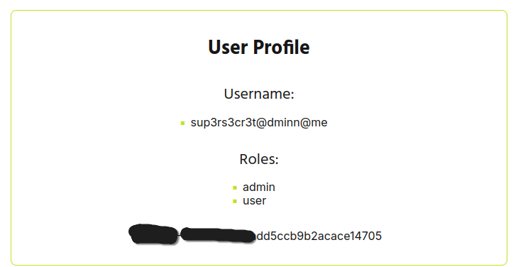

# Support: Protected endpoint 🛡️ (FLAG 3)
La dernière cible est exposée à l'adresse `/flag` sur le port 5000 du serveur

La page `/superadmin.html` permet de lancer des requêtes, mais essaye de ne permettre que les requêtes vers `127.0.0.1:4000`  
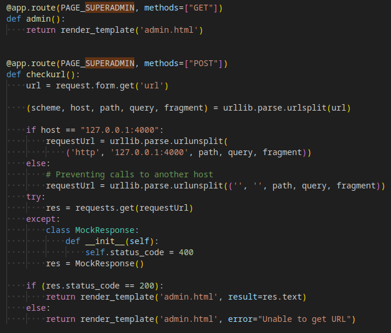  
Cette validation est faite avec `urllib.parse` dont la documentation officielle comporte la mention :  
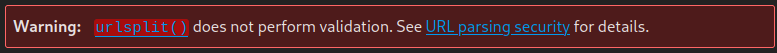  
Miam !

Un petit outil pour tester des bypass offline  
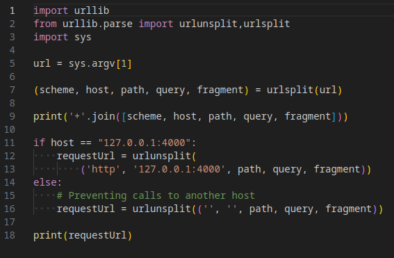  
En cherchant sur internet et par essaye-erreur je trouve certains caractères qui confondent `urlsplit` notamment : `@`, `:` et `/`  
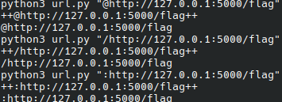  
Malheureusement, on constate que les caractères excédentaires sont conservés au début du `path`

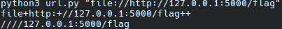  
En ajoutant un deuxième schéma à l'URL, on constat un comportement étrange avec les `://` entre le `schema` et le `host`  
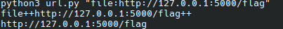  
Pour arriver finalement à l'URL malformée `file:http://127.0.0.1:5000/flag` qui nous permet de demander le flag avec succès.

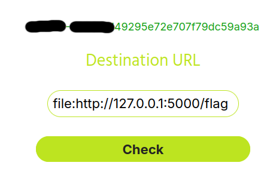
